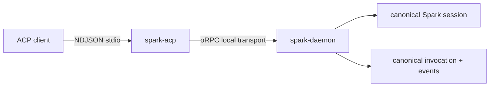

# ACP adapter maintainer contract

Status: **supported, opt-in stdio surface**. Official SDK:
[`@agentclientprotocol/sdk`](https://www.npmjs.com/package/@agentclientprotocol/sdk).

Package: [`packages/spark-acp`](../../packages/spark-acp/).

User-facing ACP setup and invocation belong in the public
[`CLI reference`](../../apps/spark-docs/src/content/docs/reference/cli.md#acp-clients).
This page owns only the adapter boundary and maintainer validation.

## Contract

| ACP method | Spark behavior |
| --- | --- |
| `initialize` | Advertises the implemented protocol version and no session-load capability |
| `session/new` | Resolves standard `cwd` through `workspace.resolve-session-cwd`, then calls daemon `session.create`; the canonical Spark session id is also the ACP session id |
| `session/prompt` | Calls `turn.submit`, polls `turn.stream`/`turn.status`, and maps assistant/tool events to ACP updates |
| `session/cancel` | Cancels only the connection-local active invocation for that session |
| `session/request_permission` | Maps Spark tool approval to ACP allow/reject and writes the answer through `human.interaction.respond` |

The adapter owns no durable state and no second session map. Its only mutable
state is the connection-local active invocation and stream cursor needed to route
cancel and incremental updates.

ACP may start from a workspace subdirectory or an attached GitChange worktree.
The daemon returns the owning workspace, normalized cwd, and optional GitChange
ref; ACP forwards all three to creation. It does not register a worktree as a
second workspace or map local paths onto SSH hosts.



## Deliberately unsupported

The supported contract does not advertise session load/resume/fork/list/delete,
provider selection, MCP-over-ACP, document sync, or OS/container execution
isolation. Unsupported prompt content fails closed instead of being silently
dropped.

## Maintainer validation

```bash
pnpm --filter @zendev-lab/spark-acp run test
pnpm --filter @zendev-lab/spark-acp run check
pnpm run test:process:source
pnpm run smoke
```
