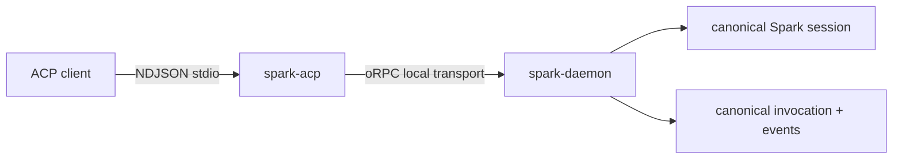

# ACP adapter (Agent Client Protocol)

Status: **supported, opt-in stdio surface**. Official SDK: [`@agentclientprotocol/sdk`](https://www.npmjs.com/package/@agentclientprotocol/sdk).

Package: [`packages/spark-acp`](../../packages/spark-acp/).

## Run

Start the daemon, then configure an ACP client to launch the adapter:

```bash
spark daemon start
spark acp
```

stdout contains ACP NDJSON only. If the daemon cannot be reached, the adapter writes a recovery hint to stderr and exits non-zero.

## Contract

| ACP method | Spark behavior |
| --- | --- |
| `initialize` | Advertises the implemented protocol version and no session-load capability |
| `session/new` | Calls daemon `session.create`; the canonical Spark session id is also the ACP session id |
| `session/prompt` | Calls `turn.submit`, polls `turn.stream`/`turn.status`, and maps assistant/tool events to ACP updates |
| `session/cancel` | Cancels only the connection-local active invocation for that session |
| `session/request_permission` | Maps Spark tool approval to ACP allow/reject and writes the answer through `human.interaction.respond` |

The adapter owns no durable state and no second session map. Its only mutable state is the connection-local active invocation and stream cursor needed to route cancel and incremental updates.



## Deliberately unsupported

The first supported contract does not advertise session load/resume/fork/list/delete, provider selection, MCP-over-ACP, document sync, or OS/container execution isolation. Unsupported prompt content fails closed instead of being silently dropped.

## Validation

```bash
pnpm --filter @zendev-lab/spark-acp run test
pnpm --filter @zendev-lab/spark-acp run check
pnpm run test:process:npm-product
pnpm run check:architecture
```
